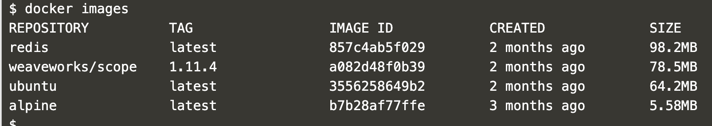
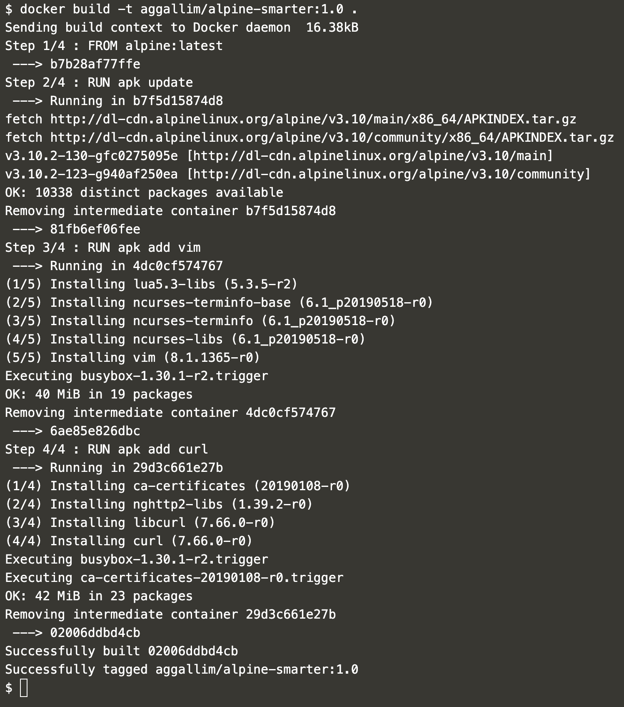
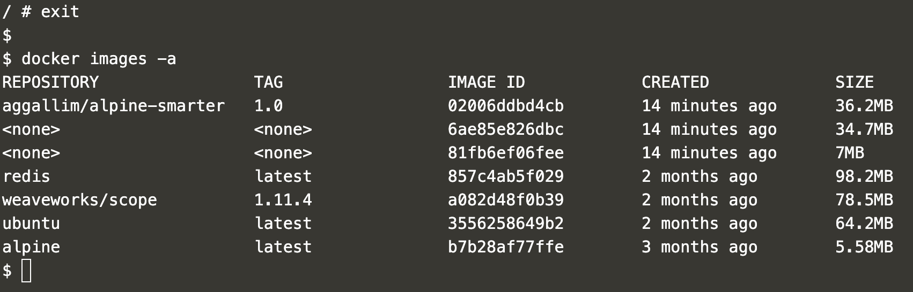
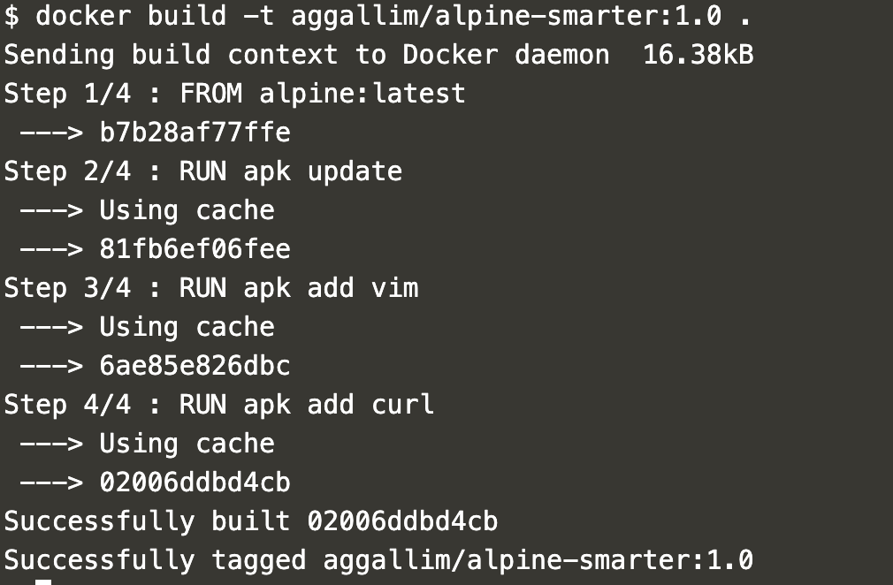
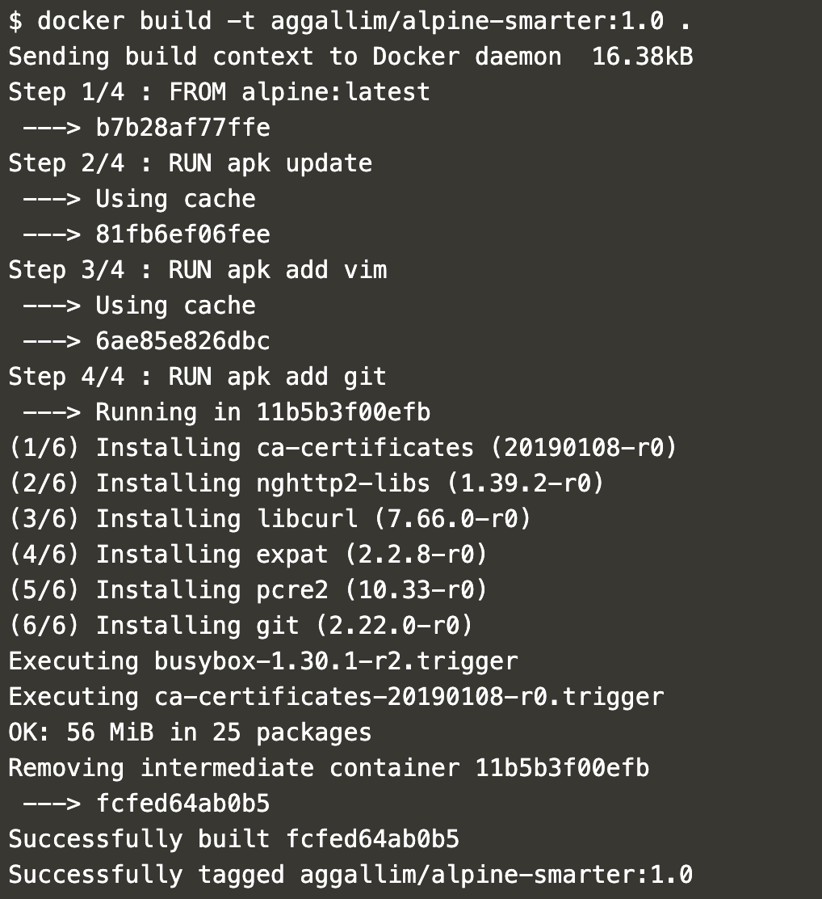
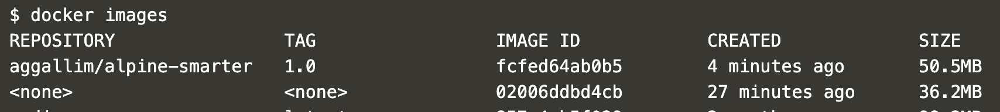
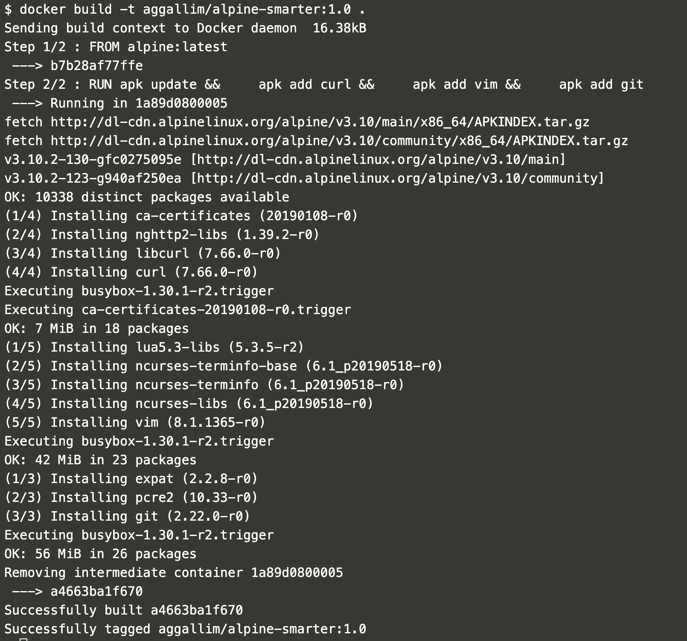

# Dockerfiles

This lab will teach you how to define, build and run your own images.

A Dockerfile is a text file that defines what a Docker image should look like. In this lab you’ll use a Dockerfile to create your own custom Docker image, in other words to define your custom environment to be used in a Docker container.

## Pre-requisits

* Whever you see %username%, replace it with your user ID.

## Docker base terms
Docker’s main purpose is to give us run-time environments that we can re-create/reproduce on any machine (that runs Docker). The main advantage is to avoid the situations when we say “it worked on in Dev”, because Docker containers will give us the same environment on all systems.

Docker containers: containers are runtime environments. You usually run one main process in one Docker container. You can think of this like one Docker container provides one service in your project. For example you can start one container to be your MySQL database and start another container to be your web/app server.

You can start containers to run all the typical applications you can think of, you can run databases, web servers, web frameworks, test servers, execute big data scripts, work on shell scripts, etc.

Docker containers are started by running a Docker image. A Docker image is a pre-built environment for a certain technology or service. A Docker image is not a runtime, it’s rather a collection of files, libraries and configuration files that build up an environment.

The main source of Docker images online is the Docker Hub <https://hub.docker.com/>. You just need to search for your preferred tech component, pull the image from docker hub with the docker pull command and you are ready to start up containers.

Containers are started from images with the docker run command. An image, as you’ll learn from this lab, is a layered representation of your environment. These layers contain the files and configuration needed by your environment.

As you start up a container with docker run, Docker will add another layer on top of your image. While your image layers are read-only, the additional layer added by the container is read-write.

## So lets create a Docker image 

Usually, you’ll want to create your own Dockerfile when existing images don’t satisfy your project needs or you want to install and configure your own set of software/tools. This is likely to be the case most of the time, which means that learning about the Dockerfile is a pretty essential part of working with Docker.

A Dockerfile is a step by step definition of building up a Docker image. The Dockerfile contains a list of instructions that Docker will execute when you issue the docker build command. Your workflow is like this:

* You create the Dockerfile and define the steps that build up your images
* You issue the `docker build` command which will build a Docker image from your Dockerfile
* Now you can use this image to start containers with the `docker run` command

We'll start by using a base Docker image on the Docker Hub, but you’ll also find images on github included with a good number of repos (in the form of a Dockerfile), or you can share Docker images within your team or company by hosting your own Docker Registry. AWS' Container Registry service is called Elastic Container Registry (ECR).

## Listing Docker images on your computer
Let’s do some hands-on magic. Before building your own Docker images, let’s see how to manage images on your computer. Use the command `docker images` in your terminal to list the images you currently have on your computer. If you have not pulled any images yet, your list may be empty.



It is worthwhile to check the image sizes in the picture. You’ll find that some images have a very small footprint, like the Alpine linux image, while more complex image take up a lot of space.

## Let’s create our first image
Let’s start by creating a modified Alpine Linux image. We’ll take the base Alpine image from the Docker hub and modify it by installing a few Linux packages.

### Create the Dockerfile
Create an empty directory for this task and create an empty file in that directory with the name Dockerfile (use your favorite file editor).

The Alpine image does not have git, vim or curl packages by default, So let’s create a custom image from Alpine that has git, vim and curl installed. This will be your first custom Docker image.

### Define the base image with FROM

Every Dockerfile must start with the FROM instruction. The idea behind is that you need a starting point to build your image. You can start `FROM scratch`, scratch is an explicitly empty image on the Docker store that is used to build base images like Alpine, Debian and so on.

Typically you'll start images from other images, either from public or internal container registries. The image you start from is called the base image. In our case let’s add `FROM alpine:latest` to the Dockerfile.

So now your Dockerfile should look like this:

```lolcode
FROM alpine:latest
```

Add `RUN` lines to the file to run commands to install packages, please add the lines to install vim and curl like this:


```
FROM alpine:3.4

RUN apk update
RUN apk add vim
RUN apk add curl
```

This is not best practice, these are just a few lines to get started. Don’t worry, you’ll learn some best practices shortly.

### Build your image

Run the following in your terminal: `docker build -t %username%/alpine-smarter:1.0 .`

This command is structured as follows:

* `docker build` is the command to build a Docker image from a Dockerfile
* -t %username%/alpine-smarter:1.0 defines the tag (hence -t) of the image, which will be basically the name of the image. As the first part you put your username to identify you as the maintainer of the image, then we gave it a human readable name alpine-smarter and provided a version number 1.0.
* The . (dot) at the end of the line is the directory where `docker build` should be looking for a Dockerfile. Therefore . tells docker build to look for the file in the current directory.

You should see a similar output in your terminal:



### Validate your image

Docker created an image from your Dockerfile. You should see a new image in your image list issuing `docker images` again.

Let’s check what’s inside our new image, let’s run the following command and check out vim and curl: `docker run --rm -ti aggallim/alpine-smarter:1.0 /bin/sh`

Right now you should be in the shell of your running container, so let issue the following commands: `vim -version` and `curl --version`. You should be seeing the version of vim and curl in your terminal.

We have successfully added two packages to the Alpine base image.

### Understand image layering

If you look at the output of your `docker build` command, you should notice that docker build provided the build output in 4 steps, namely Step 1/4, Step 2/4, Step 3/4 and Step 4/4.

At the start of each step you can see the corresponding line in your Dockerfile. This is because docker build executes the lines in the Dockerfile one at a time.

What is more important that with every step in the build process Docker will create an intermediary image for the specific step. This means that Docker will take the base image (alpine:latest), then execute `RUN apk update` and then Docker will add the resulting files from that step as another layer on top of the base image.

You can follow the concept by following the line in the output that start with `---->` these lines denote the image ids of intermediary images.

This means that the final Docker image consist of 4 layers and the intermediary layers are also available on your system as standalone images. This is useful because Docker will use the intermediary images as an image cache, which means your future builds will be much faster for those Dockerfile steps that you do not modify.

Let’s see all the images that were created. Exit the shell of your container, type `exit` to return to your terminal then run `docker images -a`.

You should see something like this, with 3 images created with the same timestamp:


We used `-a` to list all images on your computer including intermediary images. Note how the image ids are the same as the ones you see during the build process.

Only `RUN`, `COPY` and `ADD` instructions create layers to improve build performance.

The main advantage of image layering lies in image caching. If you build your Dockerfile again now with the same command `docker build -t %username%/alpine-smarter:1.0 .`, you’ll notice that the build was almost instantaneous and the output for every step says that the build was done from cache.

This behavior makes our lives a lot easier. Since image layers are built on top of each other Docker will use images cache during the build process up to the line where the first change occurs in your Dockerfile. Every later step will be re-built.



### Image cache example
Let’s play with the cache a little bit. Let’s change our Dockerfile to see the behavior. Let’s change the last `RUN` command from curl to git. This is the resulting file:

```
FROM alpine:3.4

RUN apk update
RUN apk add vim
RUN apk add git
```

Let’s issue our build command again: `docker build -t %username%/alpine-smarter:1.0 .`

You’ll see that the first 3 steps run using cache and only the last step will be re-run.



Note, If you change an earlier step in the Dockerfile, for example you add one line after apk update like this:

```
FROM alpine:3.4

RUN apk update
RUN apk add curl
RUN apk add vim
RUN apk add git
```

In this case every step after the change will be re-built. Which means that the steps to install curl, vim and git will be run from scratch, no caching will be available beyond the point where the change occured.

### Dangling images
If you run the command `docker images` now in terminal, you’ll see something nasty.



Our newly built image is ready to use, but the previous image that we built with curl is still hanging around and it does not have a proper tag or name right now. (You can check the image ids to see that this is the same image we built previously).

Docker calls such images dangling images. You can use the following command to list dangling images:

`docker images --filter "dangling=true"`

Its not good practice to leave images hanging around if they dont have a purpose, so here is how to remove them:

`docker rmi $(docker images -q --filter "dangling=true")`

## Dockerfile best practices

### Minimize the number of steps in the Dockerfile

Minimizing the number of steps in your image may improve build and pull performance. Therefore it’s a good practice to combine several steps into one line, so that they’ll create only one intermediary image.

We can reformulate our Dockerfile like this:

```
FROM alpine:3.4

RUN apk update && \
    apk add curl && \
    apk add vim && \
    apk add git
```

After building this Dockerfile the usual way you’ll find that this time it has only taken 2 steps instead of 4, which will result in 1 new image, instead of 3 images.



Keep in mind that only `RUN`, `COPY` and `ADD` instructions create layers.

### Sort multi-line instructions

It’s a good idea to sort multiline instructions in a human readable manner. The example above is not optimal, because we're still installing packages in no order at all. We should write a file like this instead, where we order packages in alphabetical order. This is very useful when you work with a long list.

```
FROM alpine:3.4

RUN apk update && \
    apk add curl && \
    apk add git && \
    apk add vim
```

### Start your Dockerfile with the steps that are least likely to change

This is easier said than done. Anyway, your image will stabilize after a while and changes will be less likely. The best practice is to structure your Dockerfile according to the following:

* Install tools that are needed to build your application.
* Install dependencies, libraries and packages.
* Build your application.

### Clean up your Dockerfile
Always review your steps in the Dockerfile and only keep the minimum set of steps that are needed by your application. Always remove unnecessary components.

### Use a .dockerignore file
The directory where you issue the docker build command is called the build context. Docker will send all of the files and directories in your build directory to the Docker daemon as part of the build context. If you have stuff in your directory that is not needed by your build, you’ll have an unnecessarily larger build context that results in a larger image size.

You can remedy this situation by adding a .dockerignore. You can specify the list of folders and files that should be ignored in the build context.

If you want to have a look at the size of your build context, just check out the first line of your docker build output. Our alpine build output for example says: `Sending build context to Docker daemon  16.38kB`.

### Containers should be ephemeral
This would belong to generic Docker guidelines, but it’s never enough to stress this point. It is your best interest to design and build Docker images that can be destroyed and recreated/replaced automatically or with minimal configuration (coroners, not doctors).

Which means that you should create Dockerfiles that define stateless images. Any state, should be kept outside of your containers.

### One container should have one role
Think of containers as entities that take responsibility for one aspect of your system. So design your application in a way that your web server, database, in-memory cache and other components have their own dedicated containers. You’ll see the benefits of such a design when scaling your app horizontally.